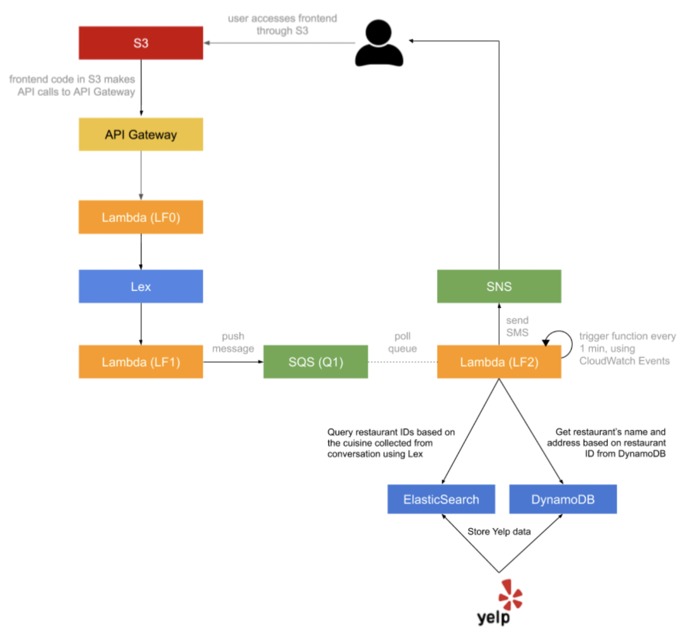

# Dining Concierge AI Agent ChatBot Using AWS Cloud Computing Components

Customer Service is a core service for a lot of businesses around the world and it is getting disrupted at the moment by Natural Language Processing-powered applications. This is an implementation of a serverless, microservice-driven web application. Specifically, a Dining Concierge chatbot that sends you restaurant suggestions given a set of preferences that you provide the chatbot with through conversation.

## High Level Architecture Diagram

Link to chatbot: http://cloud-dining-s3.s3-website-us-west-2.amazonaws.com

Directory Details
1) /frontend: Frontend Code with updated SDK generated via API Gateway
2) /lambda_functions/lambda_function_0.py: Lambda-0 python file
2) /lambda_functions/lambda_function_1.py: Lambda-1 python file
4) /lambda_functions/lambda_function_2.py : Lambda-2 python file
5) /yelp_web_scrapper: Scrapper code to receive restaurant information using Yelp Fusion API
6) /ddb_to_opensearch lambda function: Dynamodb to Opean Search Lambda Function
7) /api_gateway/api_gateway.yaml: YAML file downloaded from swagger.io with required Bot APIs
8) /lex_chatbot: Lex BOT Codebase exported from AWS Lex

## Outline:

This assignment has the following developments:

1. Built and deployed the frontend of the application
2. Frontend hosted in an AWS S3 bucket
3. Built the API for the application using API Gateway to setup  API with CORS enabled on your API methods
4. Created a Lambda function that performs the chat operation 
5. Amazon Lex. Created a new bot using the Amazon Lex service. 

## Bot Features:
The following three intents:
1. GreetingIntent
2. ThankYouIntent
3. DiningSuggestionsIntent

The implementation of an intent entails its setup in Amazon Lex as well as handling its response in the Lambda function code hook.

For the GreetingIntent
1. Created the intent in Lex, 
2. Trained and tested the intent in the Lex console, 
3. Implemented the handler for the GreetingIntent in the Lambda code hook, such that when a request for the GreetingIntent is received, a response is composed such as “Hi there, how can I help?”

For the DiningSuggestionsIntent, 
Collected the following pieces of information from the user, through conversation:
1. Location
2. Cuisine
3. Dining Time
4. Number of people
5. Phone number

Based on the parameters collected from the user, push the information collected from the user (location, cuisine, etc.) to an SQS queue. 
And notified them over SMS once with  the list of restaurant suggestions.

Integrated the Lex chatbot into your chat API using the AWS SDK to call Lex chatbot from the API Lambda.
When an API request is receives:
1. extract the text message from the API request, 
2. send it to your Lex chatbot, 
3. wait for the response, 
4. send back the response from Lex as the API response.

## Web Scrapping for collecting Restaurant Data

Used the Yelp API to collect 5,000+ random restaurants from Manhattan.
Using the following tools:
1. Yelp API
2. Get restaurants by cuisine types 
3. Each cuisine type should have 1,000 restaurants or so.
4. Made sure that restaurants don’t duplicate.

## Database
1. DynamoDB: a noSQL database
2. Created a DynamoDB table and named “yelp-restaurants”
3. Stored the restaurants in DynamoDB because some restaurants might have more or less fields than others, which makes DynamoDB ideal for storing this data
4. With each item stored, attached a key to the object named “insertedAtTimestamp” with the value of the time and date of whe the particular record is inserted
5. Stored those that are necessary for your recommendation
   1. Business ID, 
   2. Name
   3. Address
   4. Coordinates
   5. Number of Reviews
   6. Rating
   7. Zip Code
   
## AWS OpenSearch (Previously ElasticSearch) 
1. Created an ElasticSearch instance using the AWS ElasticSearch Service. 
2. Created an ElasticSearch index called “restaurants” 
3. Created an ElasticSearch type under the index “restaurants” called “Restaurant”
4. Stored partial information for each restaurant scraped in ElasticSearch under the “restaurants” index, where each entry has a “Restaurant” data type.
5 Stored RestaurantID and Cuisine for each restaurant

## BuilT a suggestions module, decoupled from the Lex chatbot.
1. CreateD a new Lambda function (LF2) that acts as a queue worker. Whenever it is invoked it 
   1. pulls a message from the SQS queue (Q1), 
   2.  gets a random restaurant recommendation for the cuisine collected through conversation from ElasticSearch and DynamoDB, 
   3. formats them and 
   4. sends them over text message to the phone number included in the SQS message, using SNS.
2. UseD the DynamoDB table “yelp-restaurants” to fetch more information about the restaurants (restaurant name, address, etc.), since the restaurants stored in ElasticSearch will have only a small subset of fields from each restaurant.
3. Modified the rest of the LF2 function if necessary to send the user text/email.
4. Set up a CloudWatch event trigger that runs every minute and invokes the Lambda function as a result. This automates the queue worker Lambda to poll and process suggestion requests on its own.
 

In summary, based on a conversation with the customer, your LEX chatbot will identify the customer’s preferred ‘cuisine’ by searching through ElasticSearch to get random suggestions of restaurant IDs with this cuisine. At this point, the DynamoDB table is queried with these restaurant IDs to find more information about the suggested restaurants to your customers like name and address of the restaurant.

 

## Extra Feature
Implementation of concierge application, such that it remembers user's last search for both location and category. When a user returns to the chat, they automatically receive a recommendation based on their previous search.

Example Interaction

User: Hello
Bot: Hi there, how can I help? 

User: I need some restaurant suggestions.

Bot: Great. I can help you with that. What city or city area are you looking to dine in?

User: Manhattan

Bot: Got it, Manhattan. What cuisine would you like to try?

User: Japanese

Bot: Ok, how many people are in your party?

User: Two

Bot: A few more to go. What date?

User: Today

Bot: What time?

User: 7 pm, please

Bot: Great. Lastly, I need your phone number so I can send you my findings.

User: 123-456-7890

Bot: You’re all set. Expect my suggestions shortly! Have a good day.

User: Thank you!

Bot: You’re welcome.

(a few minutes later)
User gets the following text message:
“Hello! Here are my Japanese restaurant suggestions for 2 people, for today at 7 pm: 1. Sushi Nakazawa, located at 23 Commerce St, 2. Jin Ramen, located at 3183 Broadway, 3. Nikko, located at 1280 Amsterdam Ave. Enjoy your meal!”

